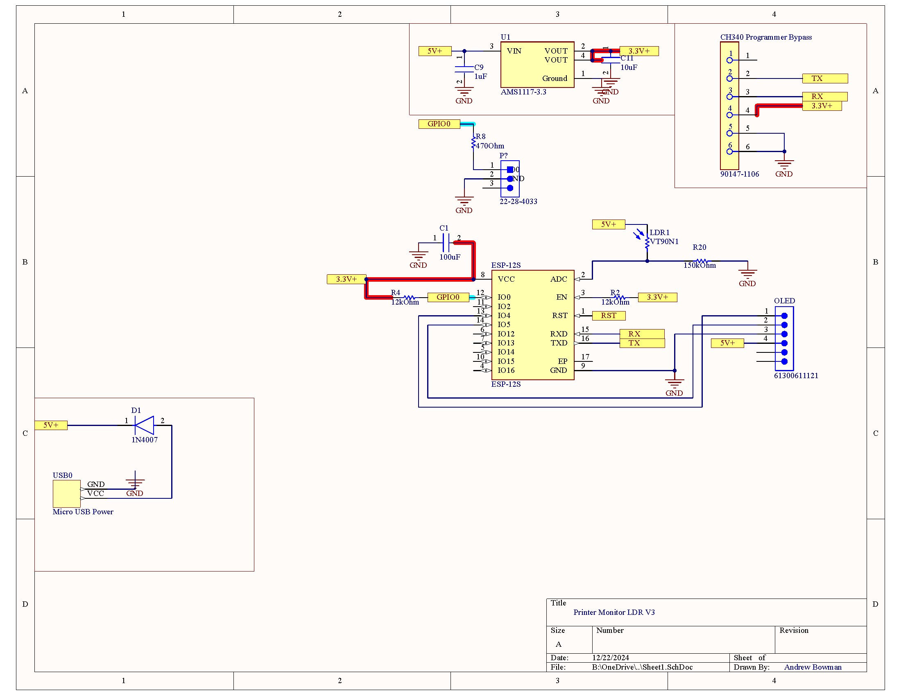
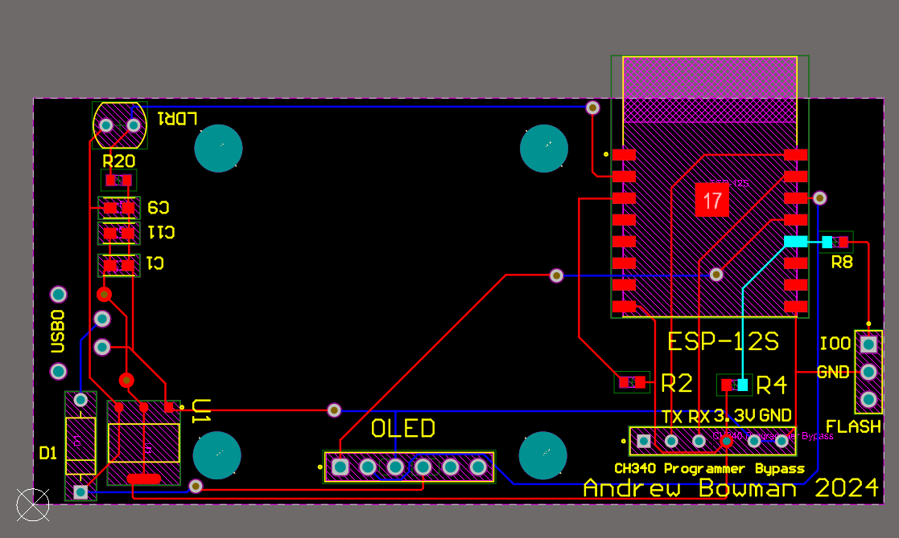

# Printer Monitor LDR PCB
Andrew Bowman 2024
## Parts
[1x Micro USB](https://www.aliexpress.us/item/3256805200931778.html?spm=a2g0o.order_list.order_list_main.40.7e141802815eHP&gatewayAdapt=glo2usa) \
[ESP-12E](https://www.aliexpress.us/item/3256804959085249.html?spm=a2g0o.order_list.order_list_main.46.7e141802815eHP&gatewayAdapt=glo2usa) \
[AMS1117-5.0 Voltage Regulator](https://www.aliexpress.us/item/3256804959085249.html?spm=a2g0o.order_list.order_list_main.46.7e141802815eHP&gatewayAdapt=glo2usa) \
SH1106 OLED Display \
1x 1N4007 Diode \
2x 12kOhm 0603 Resistors \
1x 150kOhm 0603 Resistor \
1x 1uF 0603 Capacitor, this can be substituted with a 10uF if needed \
1x 10uF 0603 Capacitor \
1x 100uF 0603 Capacitor \
1x Light Dependant Resistor, this can be omiitted if you want the screen to stay on. \
Various headers \
Solder paste
ESP-12 Programmer or CH340 USB Programmer

